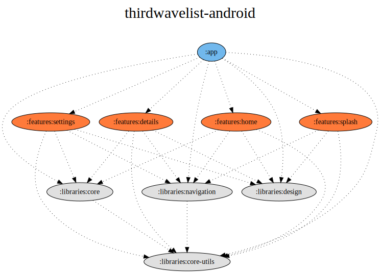

#  ThirdWaveList for Android

<a href='https://play.google.com/store/apps/details?id=com.thirdwavelist.coficiando&pcampaignid=MKT-Other-global-all-co-prtnr-py-PartBadge-Mar2515-1'></a>

[](/LICENSE) []()

## How to run

This project was written **using Android Studio Bumblebee**, and given the usage of Dagger Hilt, modularization and kapt,
it is required to run it on AGP 7.1.0+ and make sure you have Java 11 installed (See caveats for more info).

If the compiler is complaining about JDK 11 (in case you are not using the embedded one), make sure you install that first and check
the Project Structure -> SDK Location -> JDK location settings.

So to sum up, in order to compile and run the project you will need:
- AS Bumblebee with AGP >7.1.0
- Java 11 SDK installed

## Features:
- Fetches data from https://api.thirdwavelist.com (API key required), parsed in the common `:libraries:core` module, under the `data` layer, and presented in a RecyclerView
- Clicking on a RV item triggers a navigation action (Android Navigation Components) and opens detail view for the given item
- After the initial successful network request, the data is stored in a local database using Room
- Settings page
- Splash screen
- `:libraries:design` module implementing Material Design guidelines
- Common abstractions in `:libraries:core-utils` and `:libraries:core` modules
- Navigation abstraction in `:libraries:navigation` module implementing Android Navigation Components
- Integrated Firebase Config for feature toggling and configuration keys

## Project overview



## Caveats

1. Running this project on older Android Studio that does not support running AGP 7.0.0 or higher,
because of an experimental flag required to make the build of multi module kapt annotation more stable 
for the Dagger Hilt library used across this project. While this is something that would not be acceptable 
at a large scale in an organization, for a project like this, I have accepted this drawback in hindsight,
since Dagger Hilt gave a lot more help in writing succinct, boilerplate free code.

2. The original codebase that was written >3 years ago was built on pure MVVM approach (with DataBinding and a bi-directional data flow).
This was problematic, since it didn't reflect my current thinking and its also going against some bigger trends in the industry: 
Compose (Data Binding is problematic), MVI (bi-directional data flow is problematic), so I removed the use of Data Binding, replaced it with ViewBinding,
finite View State (machine), and while I didn't really capture true unidirectional data flow (UDF), it also does not go against some of the practices
that would allow that change. Same goes with Compose; it's not integrated, but with the current architecture, it wouldn't be any blocker to do so.

## What would I do differently / improve on?

1. Change the Timber library use behind the ErrorEventLogger and BusinessEventLogger abstraction to use some actual backend/PaaS (e.g. Firebase) to
make sense of the data that's being logged

2. Add missing UI tests: as a side project, and with the one-week deadline to cover all requirements and make sure the code reflects my current 
architectural thinking, I figured it was not the smartest to invest my time on writing UI tests for these screens. I just wanted to acknowledge that.

3. More work on the presentation / repository layer to support paging from both the remote and local data sources. I didn't pick this up, since this
would have required me to touch the API (which I developed as well 3 years ago), and it wasn't the most critical aspect to get right at the start.

## License

```Text
BSD 3-Clause License

Copyright (c) 2017 - 2021, Antal János Monori & Kristoffer Tjalve
All rights reserved.
```

_See [LICENSE](/LICENSE) for more._
